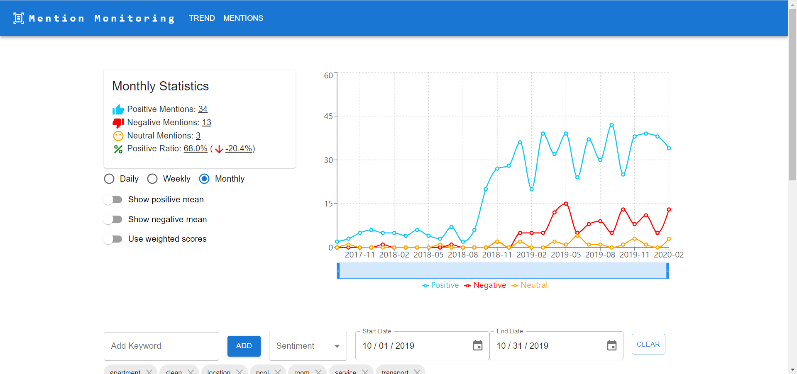
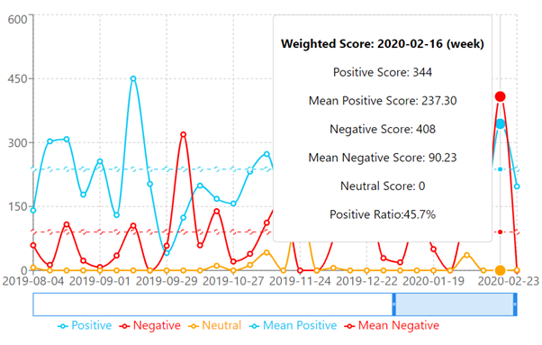
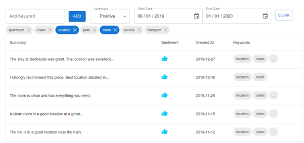
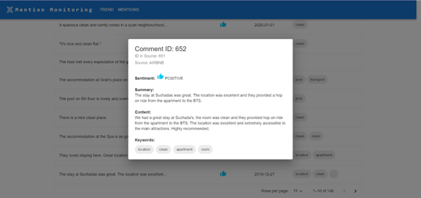
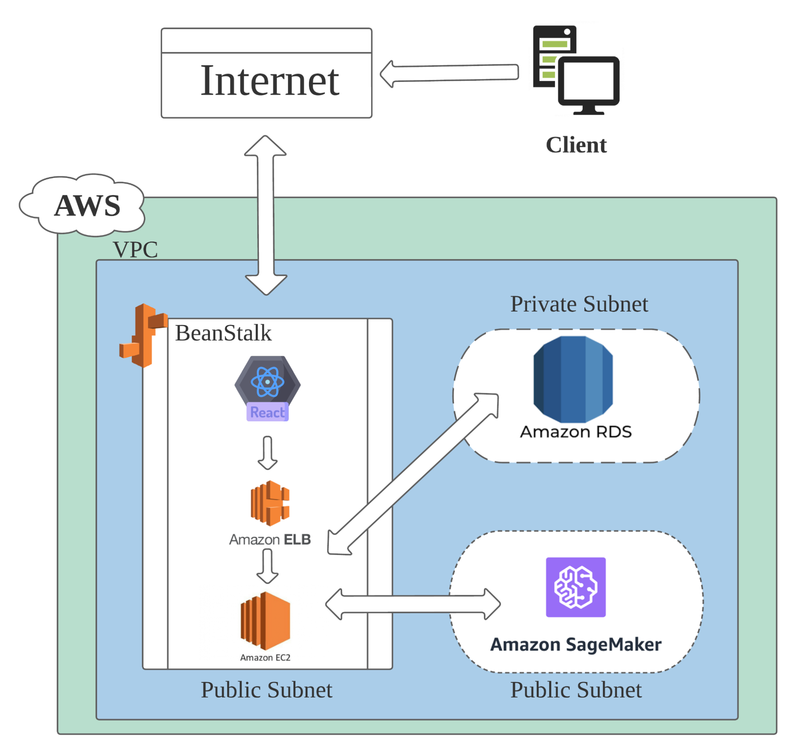

# mention-monitoring-saas
This project is a SaaS solution for public opinion tracking and analysis. It is specifically designed to assist businesses in effectively monitoring, analyzing, and understanding customer sentiments and feedback gathered from social media platforms and review websites. <br>
# Feature Overview
- *Mention Monitoring*: The application searches for and records mentions of the business on various social media platforms and reviews websites daily.
- *Sentiment Analysis*: The application utilizes NLP models to analyze and interpret the emotions and feelings expressed in customer comments.
- *Comment Summarization*: The application generates concise summaries of customer comments and categorizes them into business-interested topics.
- *Data Visualization*: The application displays the information and analysis in interactive tables and charts.
# Application Overview
 <br>
Upon accessing the website, users are greeted with a dashboard on the left side, which summarizes the trends mentioned for the current period. This dashboard displays changes in positive, negative, and neutral mentions and the ratio of positive mentions. Users have the flexibility to adjust the time frame to daily, weekly, or monthly intervals and can opt for a weighted score, where each mention is assigned a quality-based score.  <br>
 <br>
To the right of the dashboard, a line chart illustrates the historical trends of mentions. By hovering the mouse over a specific period, a panel containing detailed information will appear. Users have the option to toggle the display of the mean score on or off and can adjust the time range of the chart using the scroll bar beneath it. Additionally, the chart can be switched between displaying count and weighted scores.  <br>
 <br>
Scrolling further down brings users to the Mentions Overview section, presenting a table summarizing the collected mentions. Users can filter mentions based on sentiment, creation time, and keyword labels. Interacting with data points on the line chart automatically sets the date filter to the corresponding time period.  <br>
 <br>
Finally, clicking on a table entry triggers a popup containing comprehensive information about the selected mention.  <br>
# SaaS Architecture  <br>
 <br>
The application utilizes a three-tier architecture and is deployed on AWS cloud.
The front end is crafted with the React framework and Material UI libraries.
The Restful server is developed using Java Spring. Two pre-trained NLP models, twitter-xlm-roberta-base-sentiment and knkarthick/meeting_summary, were tuned and integrated into the backend.
A MySQL database hosted on AWS RDS, which offers high availability and scalability.
# Deployment Instructions
### Deploy MySQL Database on RDS:
- Sign in to your AWS Management Console and navigate to the RDS service.
- Click on the "Create database" button.
- Choose the "Standard Create" method and select "MySQL" as the database engine.
- Configure the settings for your MySQL instance:
- Set the unique identifier for the "DB instance identifier." to mentionmonitor
- Set the "Master username" and "Master password" for the database.
- In the "Connectivity" section, select the desired VPC or create a new one.
- Click on "Additional connectivity configuration," and set "Publicly accessible" to "Yes."
- Under "VPC security group," create a new security group or select an existing one. Take note of the security group's name or ID for later use.
- Configure the remaining settings as required, and click "Create database" to start provisioning the RDS MySQL instance.
- For demo purpose, we used published Airbnb review database and created a mock API endpoint for retrieving reviews. For the mock API to function properly, inside mentionmonitor database,you’ll have to create a table named review_content with the following columns: <be>
```
    rid		bigint (primary key)
    lid		bigint
    date		date
    comments	varchar(8191)
```
Then, load the data from mock/mock_data.csv into the table 
### Deploy NLP models on SageMaker:
- Create SageMaker domain and role
- Access SageMaker Studio and upload deploySageMaker.ipynb to the studio
- Run the first cell to create the two endpoints
### Deploy Backend on Beanstalk:
- Make sure Maven is installed. You can check if it is installed by running 
`mvn -version`

- Create a file named `.env` in `mention-monitoring\src\main\resources` directory. In the `.env` file, add the following lines (You can also choose to setup the software environment configuration in Beanstalk later instead): <br>
```
DATABASE_URL = <Your RDS URL>
DATABASE_NAME = mentionmonitor
DATABASE_USERNAME = <Your RDS Master Username>
DATABASE_PASSWORD = <Your RDS Master Password>
```
- Run mvn clean install in the terminal, this should generate a JAR file in the mention-monitoring\targe directory
- Sign in to the AWS Management Console and open the Elastic Beanstalk console.
- Click on "Create a new environment" and choose "Web server environment"
- In the "Environment information" section, provide an application name, an environment name, and a domain
- In the "Platform" section, choose "Java" as the platform and select the latest Java version
- In the "Application code" section, click on "Upload your code" and upload the packaged Java Spring Boot application JAR file you created in Step 3
- Click "Create environment", the backend should be deployed after a few minutes. A url to your backend should be available
### Deploy Frontend on Beanstalk:
- Open the frontend directory by running `cd ./frontend`
- Create another file named `.env` with the following line
`REACT_APP_BACKEND_API_URL= <Your Beanstalk Backend URL>`

- Make sure npm is installed. You can check if it is installed by running
`npm -v`

- Install project dependencies by running npm install
- Create a production build by running the following command in the terminal:
  `npm run build`
- This command will generate a build directory containing the production-ready static files.
- Create a ZIP file containing the build directory and everything inside it, server.js, and package.json  
- Open the Elastic Beanstalk console, and click on "Create a new environment" again, and choose "Web server environment"
- In the "Environment information" section, provide an application name, an environment name, and a domain
- In the "Platform" section, choose "Node.js" as the platform and select the latest Node.js version
- In the "Application code" section, click on "Upload your code" and upload the ZIP file
- Click "Create environment", the frontend should be deployed after a few minutes. A url to the frontend should be available. You are ready to go.


